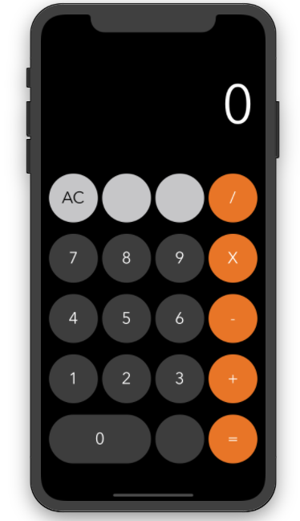

# calculadoraIOS

## Réplica de Calculadora da Apple criada para a Aula de IOS da Digital House.

**Funcionalidades atuais:** 

 1. Soma
 2. Subtração
 3. Multiplicação
 4. Divisão

Clicar no botão *igual* gera o resultado e também reinicia a calculadora. 
O botão AC ainda não funciona.

Ajustes serão feitos ao longo do curso.

